# Open Polymer: Winning Kaggle Solution

**Polymer property prediction using simple features + external data + Kaggle automation.**

🏆 **Score: 0.07533 (Private) | 0.08139 (Public) | 🥇 TIED WITH 1ST PLACE SOLUTION!** | Random Forest Ensemble with Pseudo-Labeled Data | Time: ~50 seconds per submission

## TL;DR

```bash
# Make changes to notebook, then submit:
python kaggle/kaggle_automate.py "Your message"

# Done! Get score in ~3 minutes (push + execute + submit + score)
```

## Why This Works

| What | Why | Result |
|------|-----|--------|
| **Massive external data** | Tg: 511→2,447 (+380%), Density: 613→1,394 (+127%) | +2% improvement (0.085→0.083) |
| **Ensemble (5 models)** | Variance reduction through model averaging | +0.4% improvement (0.083→0.08266) |
| **Chemistry features (21)** | Polymer-specific: branching, backbone, H-bonding | +3.1% improvement (0.08266→0.08008) |
| **SMILES canonicalization** | Standardizes SMILES representations to avoid duplicates | Part of v85 improvement ✨ |
| **Pseudo-labeled data (50K)** | BERT + AutoGluon + Uni-Mol ensemble predictions | Part of v85 improvement 🚀 |
| **Tg transformation** | 2nd place solution: (9/5) × Tg + 45 | Major improvement |
| **MAE objective** | Match competition metric exactly | +5-15% improvement |

**Key insight:** Combining canonicalization + pseudo-labels with simple features + Random Forest ensemble delivered **0.07533 (Private) / 0.08139 (Public) - TIED WITH 1ST PLACE!** 🎯
(Note: Individual improvement amounts for canonicalization and pseudo-labeling not separately quantified)

## Score Progress (Empirical)

### Phase 1: Data Augmentation (v1-v7)
| Version | Configuration | Score | Change  | Leaderboard Placement |
|---------|---------------|-------|---------|----------------------|
| v1 | Original data only | 0.139 | Baseline | 2000th |
| v2 | + Tc dataset (Tc-SMILES) | 0.09228 | ↓ 33.8% | 453th |
| v3 | + Tg dataset (TG-of-Polymer) | 0.08548 | ↓ 7.6% | 15th 🥉 |
| v4 | + Density (PI1070) | 0.08871 | Reverted ⚠️ | 66th |
| v5 | + Tc +Tg +Rg +LAMALAB (7,369 Tg) | 0.08334 | ↓ 2.4% ✅ | 13th |
| v6 | + Ensemble (5 models per property) | 0.08266 | ↓ 0.4% | 10th |
| v7 | + 21 chemistry features (14th place insights) | 0.08008 | ↓ 3.1% ✅ | 6th 🏆 |

**Total improvement: 0.139 → 0.08008 = 42.4% error reduction** 🎉
### What's in v2
- **Tg Transformation**: Uses 2nd place winner's discovery: (9/5) × Tg + 45
- **Distribution shift**: Corrects for train/test distribution shift in glass transition temperature

### What's in v6 (Ensemble)
- **Ensemble XGBoost**: 5 independent models per property with different random seeds
- **Model averaging**: Predictions averaged across all 5 models for variance reduction
- **Same 10 basic features**: smiles_length, carbon_count, nitrogen_count, etc.
- **Benefit**: Reduces overfitting through model diversity (different random states)

### What's in v7 (Ensemble + Chemistry Features)
Built on v6, adds **11 chemistry-based features** inspired by 14th place solution:

**Structural Features:**
1. `num_side_chains` - Polymer branching from backbone
2. `backbone_carbons` - Main chain carbon count
3. `branching_ratio` - Side chains per backbone carbon

**Chemical Properties:**
4. `aromatic_count` - Aromatic ring content (affects rigidity, Tg)
5. `h_bond_donors` - Hydrogen bonding donors (O, N)
6. `h_bond_acceptors` - Hydrogen bonding acceptors
7. `num_rings` - Total ring structures
8. `single_bonds` - Chain flexibility indicator
9. `halogen_count` - F, Cl, Br content
10. `heteroatom_count` - N, O, S atoms
11. `mw_estimate` - Molecular weight approximation

**Total: 21 features** (10 basic + 11 chemistry)

**Key Insight:** Chemistry features capture polymer-specific properties (branching, backbone structure, H-bonding) that correlate with Tg, density, and other target properties.

### Phase 2: Systematic Hyperparameter & Model Testing (v48-v54)

| Version | Model | Hyperparameters | Private / Public | Change | Status |
|---------|-------|----------------|------------------|--------|--------|
| **v48** | **XGBoost Ensemble** | n=500, lr=0.05, depth=8, subsample=0.8, colsample=0.8 | **0.08008 / 0.10125** | Baseline | ✅ |
| v50 | XGBoost | n=500, lr=0.05, **depth=10**, **reg_lambda=3.0**, **min_child_weight=3** | 0.08081 / 0.09915 | ↑ +0.9% ❌ | Worse |
| v51 | XGBoost | **n=800**, **lr=0.03**, depth=8, subsample=0.8, colsample=0.8 | 0.07977 / 0.10186 | ↓ 0.4% ✅ | Better! |
| v52 | XGBoost | n=500, lr=0.05, depth=8, **subsample=0.9**, **colsample=0.7**, **colsample_bylevel=0.7** | 0.07965 / 0.10102 | ↓ 0.5% ✅ | **Better! 5th place in leaderboard 🥇** |
| **v53** | **Random Forest** | **n=500**, **depth=15**, **min_split=5**, **min_leaf=2**, **max_features='sqrt'** | **0.07874 / 0.10354** | **↓ 1.7% ✅** | **BEST! 4th place in leaderboard 🥇** |
| v54 | LightGBM | n=500, depth=8, num_leaves=63, objective='mae' | 0.08011 / 0.09492 | ↑ +0.1% ❌ | Slightly worse |

**Total improvement: 0.139 → 0.07874 = 43.4% error reduction** 🎉

**Key Findings:**

1. **🏆 Random Forest (v53) wins!** 
   - Simple decision tree ensemble with depth=15, max_features='sqrt'
   - **Best private score: 0.07874** (1.7% improvement over v48, 1.1% better than XGBoost v52)
   - Validation: Tg MAE=36.18 (R²=0.80), Density MAE=0.045 (R²=0.82)
   - **Why it works**: Random Forest's variance reduction through bagging complements the chemistry features well

2. **Feature sampling XGBoost (v52) strong runner-up**
   - Subsample 0.9 (more data per tree) + colsample 0.7 (feature diversity)
   - Private score: 0.07965 (0.5% improvement over v48)
   - Improves generalization by reducing feature correlation

3. **LightGBM (v54) slightly worse than XGBoost**
   - Score: 0.08011 / 0.09492 (0.1% worse than baseline)
   - Fast training but slightly overfits compared to XGBoost
   - Best validation on Density (MAE=0.039, R²=0.84)

4. **More trees + slower learning (v51) helps**
   - 800 trees with lr=0.03 achieves 0.07977 (0.4% improvement)
   - Nearly as good as v52, but 60% longer training time

5. **Deeper trees + regularization (v50) slightly worse**
   - depth=10 + L2 regularization causes slight overfitting
   - Private: 0.08081 (+0.9% worse than baseline)
   - Public: 0.09915 (better than baseline, but doesn't generalize)

**Key insight**: Random Forest's bagging approach (bootstrap + feature randomness) works better than XGBoost's boosting for this polymer dataset with 21 chemistry features. The simpler averaging strategy is more robust than gradient boosting's sequential error correction.

### Phase 3: Canonicalization + Pseudo-Labeling (v85)

| Version | Enhancements | Private / Public | Change | Status |
|---------|--------------|------------------|--------|--------|
| **v85** | **+ SMILES canonicalization + 50K pseudo-labeled data** | **0.07533 / 0.08139** | **↓ 4.3% ✅** | **🥇 TIED WITH 1ST PLACE!** |

**Key improvements in v85:**
1. **SMILES Canonicalization** - Standardizes SMILES representations (e.g., CC(C) vs C(C)C both map to same canonical form)
   - Ensures consistent molecular representation across all samples
   - Reduces noise from duplicate molecular structures with different SMILES notations

2. **Pseudo-Labeled Dataset** - 50K high-quality predictions from ensemble (BERT + AutoGluon + Uni-Mol)
   - Massively expands training data without manual annotation
   - Leverages multiple model predictions for robustness
   - Provides diverse training examples for better generalization
   
**Note:** Individual improvement contributions (canonicalization +X%, pseudo-label +Y%) cannot be separated cleanly as both are integrated in the final v85 model.

**Total improvement: 0.139 → 0.07533 = 45.8% error reduction** 🎉
**Final leaderboard position: TIED WITH 1ST PLACE 🥇**


## Setup

### 1. Clone Repository
```bash
git clone https://github.com/jihwanksa/open_polymer.git
cd open_polymer
```

### 2. Create Conda Environment (Recommended)
```bash
# Create environment with Python 3.10
conda create -n polymer python=3.10 -y

# Activate environment
conda activate polymer

# Install dependencies
pip install -r requirements.txt
```

**Note:** Using conda is recommended because:
- `torch_geometric` and `torch` require compatible versions
- Avoids system Python conflicts
- Isolated dependencies per project

### 3. Verify Installation
```bash
python -c "import torch; import torch_geometric; print(f'PyTorch: {torch.__version__}, PyG: {torch_geometric.__version__}')"
```

## 🏆 Best Kaggle Submission

**`best.ipynb`** - **🥇 TIED WITH 1ST PLACE SOLUTION!**
- **Model:** Random Forest Ensemble with 21 chemistry features + Simple 10 features
- **Private Score:** 0.07533 ⭐⭐
- **Public Score:** 0.08139
- **Key Enhancements:** 
  - SMILES canonicalization (standardized molecular representations)
  - 50K pseudo-labeled data (BERT + AutoGluon + Uni-Mol ensemble)
  - 2nd place Tg transformation: (9/5) × Tg + 45
- **Status:** Production-ready, deployed to Kaggle!

This notebook achieved **45.8% total error reduction** from baseline (0.139 → 0.07533) and tied the 1st place leaderboard score through combination of data augmentation, canonicalization, and pseudo-labeling.

## Pseudo-Label Generation (v85 Enhancement)

### Environment Setup for Pseudo-Labeling

The pseudo-label generation uses a **separate conda environment** to avoid conflicts:

```bash
# Create isolated environment for pseudo-labeling
conda create -n pseudolabel_env python=3.10 -y
conda activate pseudolabel_env

# Install required packages
pip install torch torchvision torchaudio --index-url https://download.pytorch.org/whl/cpu
pip install transformers pandas scikit-learn numpy tqdm rdkit

# Verify MPS (Apple Silicon) is available
python -c "import torch; print(f'MPS available: {torch.backends.mps.is_available()}')"
```

**Why separate environment?**
- Avoids conflicts with torch_geometric (which requires specific PyTorch/CUDA versions)
- Isolates BERT/Uni-Mol dependencies
- Cleaner dependency management for CPU/MPS execution

### Pseudo-Label Generation Workflow

#### Overview Diagram


#### Step-by-Step Scripts

**1. Train BERT Prediction Heads**
```bash
conda activate pseudolabel_env
python pseudolabel/train_bert_heads.py \
    --epochs 10 \
    --batch_size 32 \
    --learning_rate 0.001
```
- **Input:** Training data (`data/raw/train.csv`)
- **Output:** `models/bert_heads/` (5 heads: one per property)
- **Time:** ~4-5 minutes
- **Device:** Automatic (CUDA > MPS > CPU)

**Script Details:**


**2. Generate BERT Pseudo-Labels**
```bash
python pseudolabel/generate_with_bert.py \
    --input_data data/PI1M_50000_v2.1.csv \
    --bert_model_name_or_path unikei/bert-base-smiles \
    --heads_path models/bert_heads/prediction_heads.pkl \
    --output_path pseudolabel/pi1m_pseudolabels_bert.csv
```
- **Input:** 50K SMILES + trained BERT heads
- **Output:** `pi1m_pseudolabels_bert.csv` (50K × 5 properties)
- **Time:** ~5 minutes
- **Output size:** 6.9 MB

**3. Train Uni-Mol Prediction Heads**
```bash
python pseudolabel/train_unimol_heads.py \
    --unimol_model_path pseudolabel/unimol_checkpoint.pt \
    --epochs 50 \
    --batch_size 32
```
- **Input:** Training data + Uni-Mol checkpoint
- **Output:** `models/unimol_heads/prediction_heads.pkl`
- **Time:** ~3-4 minutes
- **Note:** Checkpoint must be pre-downloaded from Hugging Face

**Uni-Mol Setup (first time only):**
```bash
# Download checkpoint
mkdir -p pseudolabel
cd pseudolabel
# Download from https://huggingface.co/dptech/Uni-Mol2/tree/main/modelzoo/84M
# Or use wget if available:
# wget https://huggingface.co/dptech/Uni-Mol2/resolve/main/modelzoo/84M/unimol2_checkpoint.pt -O unimol_checkpoint.pt
```

**4. Generate Uni-Mol Pseudo-Labels**
```bash
python pseudolabel/generate_with_unimol.py \
    --input_data data/PI1M_50000_v2.1.csv \
    --unimol_model_path pseudolabel/unimol_checkpoint.pt \
    --heads_path models/unimol_heads/prediction_heads.pkl \
    --output_path pseudolabel/pi1m_pseudolabels_unimol.csv
```
- **Input:** 50K SMILES + trained Uni-Mol heads
- **Output:** `pi1m_pseudolabels_unimol.csv` (50K × 5 properties)
- **Time:** ~2 minutes (deterministic embeddings)
- **Output size:** 5.1 MB

**5. Ensemble BERT + Uni-Mol**
```bash
python pseudolabel/ensemble_bert_unimol.py \
    --bert_labels pseudolabel/pi1m_pseudolabels_bert.csv \
    --unimol_labels pseudolabel/pi1m_pseudolabels_unimol.csv \
    --output_path pseudolabel/pi1m_pseudolabels_ensemble_2models.csv
```
- **Input:** BERT predictions + Uni-Mol predictions
- **Output:** Averaged predictions (`pi1m_pseudolabels_ensemble_2models.csv`)
- **Time:** ~1 minute
- **Output size:** 6.8 MB

#### Complete Pseudo-Label Generation Pipeline

```mermaid
sequenceDiagram
    participant User
    participant BERT
    participant UniMol
    participant Ensemble
    participant RF
    
    User->>BERT: Train heads (train.csv)
    BERT->>BERT: 7973 samples → embeddings → heads
    
    User->>BERT: Generate predictions (50K)
    BERT->>BERT: 50K SMILES → embeddings → predictions
    Note over BERT: pi1m_pseudolabels_bert.csv
    
    User->>UniMol: Train heads (train.csv)
    UniMol->>UniMol: 7973 samples → embeddings → heads
    
    User->>UniMol: Generate predictions (50K)
    UniMol->>UniMol: 50K SMILES → embeddings → predictions
    Note over UniMol: pi1m_pseudolabels_unimol.csv
    
    User->>Ensemble: Average BERT + Uni-Mol
    Ensemble->>Ensemble: Element-wise mean
    Note over Ensemble: pi1m_pseudolabels_ensemble_2models.csv
    
    User->>RF: Combine with original data
    RF->>RF: 7973 + 50K = 57,973 samples
    RF->>RF: Train v85 model
    Note over RF: models/random_forest_v85_best.pkl (0.07533 Private!)
```



#### Pseudo-Label Quality Comparison

| Metric | BERT | Uni-Mol | Ensemble (BERT + Uni-Mol) |
|--------|------|---------|---------------------------|
| **Tg Mean** | 160.19 | 224.51 | 192.35 |
| **Tg Std** | 7.27 | 112.02 | 56.13 |
| **FFV Mean** | 0.3609 | 0.3677 | 0.3643 |
| **FFV Std** | 0.0232 | 0.0112 | 0.0129 |
| **Generation Time** | ~5 min | ~2 min | ~1 min |
| **File Size** | 6.9 MB | 5.1 MB | 6.8 MB |

**Key Insights:**
- **BERT:** More conservative (lower Tg variance), better FFV stability
- **Uni-Mol:** More variable (higher Tg variance), captures more diversity
- **Ensemble:** Best of both worlds - balanced variance, robust predictions

## Local Training

Train models locally to validate performance before pushing to Kaggle:

### 1. Train Best Random Forest Model (v85 - 1st Place!)
```bash
conda activate polymer
python src/train_v85_best.py
```
**Output:** `models/random_forest_v85_best.pkl` (the 1st place leaderboard model!)
**Score:** Private 0.07533 | Public 0.08139
**Time:** ~50 seconds
**Features:** 21 chemistry-based features + data augmentation

### 2. Train Graph Neural Network (GNN)
```bash
conda activate polymer
python src/train_gnn_tuned.py
```
**Output:** `models/gnn_best_tuned.pt`
**Current Best:** GNN_Wider with 0.173055 wMAE (validation)
**Features:** RDKit-enhanced node features (16 dims) + edge features (6 dims)
**GPU Acceleration:** 
- NVIDIA CUDA: Automatic ✅ (Recommended, fully supported)
- Apple Silicon (M1/M2/M3): CPU (PyTorch Geometric doesn't support MPS scatter ops yet)
- Intel Mac: CPU ⚠️

**Note:** PyTorch Geometric's graph operations (scatter_reduce) aren't implemented on MPS yet. 
See: https://github.com/pytorch/pytorch/issues/77764

Training will run on CPU, which is still reasonably fast for small graphs (~10K samples).

### 3. Train Transformer Model (Optional)
```bash
conda activate polymer
python src/train_transformer.py
```
**Output:** `models/transformer_model.pt`
**GPU Acceleration:** 
- NVIDIA CUDA: Automatic ✅
- Apple Silicon (M1/M2/M3): MPS enabled ✅ (Full support!)
- CPU fallback: ⚠️ (30-40 minutes)

**Architecture:** DistilBERT-based SMILES encoder
**Time:** ~5-10 min (GPU) | ~30-40 min (CPU)

## Workflow

### Standard Iteration (no new datasets)
1. **Edit notebook:** `polymer-v32-enhanced-tc-tg-augmentation.ipynb`
2. **Submit:** `python kaggle/kaggle_automate.py "v25: your change"`
3. **Get score:** Check terminal output in ~3 minutes

### When Adding New Datasets
1. **Add datasets in Kaggle notebook UI** (Add Input section)
2. **Update metadata:** Edit `kernel-metadata.json` to include new dataset slug
3. **Submit:** `python kaggle/kaggle_automate.py "v26: added new data"`
4. **Get score:** ~3 minutes

That's it!

## Files

| File | Purpose |
|------|---------|
| `polymer-v32-enhanced-tc-tg-augmentation.ipynb` | Working notebook (2K lines) |
| `kaggle/kaggle_automate.py` | One-command automation |
| `src/kaggle_solution.py` | Reusable solution classes |
| `kernel-metadata.json` | Kaggle kernel configuration with datasets |

## Using Solution Code

```python
from src.kaggle_solution import SimpleFeatureExtractor, KaggleSolution

# Extract 10 simple features
extractor = SimpleFeatureExtractor()
X = extractor.extract_features(df)

# Train XGBoost with MAE objective
solution = KaggleSolution()
solution.train(X_train, y_train)

# Predict with Tg transformation
predictions = solution.predict(X_test)
predictions = solution.apply_tg_transformation(predictions)
```

---

## Pseudo-Label Generation: 3-Model Ensemble

**Status:** ✅ Complete (50K pseudo-labels from BERT + Uni-Mol + AutoGluon)

We generated 50,000 high-quality pseudo-labels using a **3-model ensemble**:

### Three Models

1. **BERT (unikei/bert-base-smiles)**: Transformer encoder, 768-dim embeddings
   - Conservative predictions (Tg Std: 7.27)
   - Works on both CPU and MPS

2. **Uni-Mol (dptech/Uni-Mol2)**: Graph Neural Network, 512-dim embeddings
   - High diversity (Tg Std: 112.02)
   - Works on both CPU and MPS

3. **AutoGluon**: Automated ML ensemble on simple features
   - RF + XGBoost + LightGBM ensemble
   - **Important:** CPU-only mode (MPS hangs). Add before import:
     ```python
     os.environ['MPS_ENABLED'] = '0'
     ```

### Ensemble Results

**3-Model Ensemble (BERT + Uni-Mol + AutoGluon):**
- Tg: Mean=183.13, Std=55.17 (balanced variance)
- FFV: Mean=0.3652, Std=0.0153 (stable)
- Tc: Mean=0.2363, Std=0.0343 (robust)
- Density: Mean=1.0383, Std=0.0641 (balanced)
- Rg: Mean=16.4557, Std=1.2669 (balanced)

### Impact on v85

- **Original training:** 7,973 samples
- **After pseudo-labels:** 57,973 samples (+626%)
- **Score:** 0.07533 (Private) / 0.08139 (Public) = **🥇 Tied 1st Place!**

All 50K pseudo-labels use Tg transformation: `(9/5) × Tg + 45`

**Files generated:**
- `pi1m_pseudolabels_bert.csv` (6.9 MB) - BERT-only predictions
- `pi1m_pseudolabels_unimol.csv` (5.1 MB) - Uni-Mol-only predictions
- `pi1m_pseudolabels_autogluon.csv` (5.1 MB) - AutoGluon-only predictions
- `pi1m_pseudolabels_ensemble_2models.csv` (6.8 MB) - BERT + Uni-Mol
- `pi1m_pseudolabels_ensemble_3models.csv` (6.8 MB) - BERT + Uni-Mol + AutoGluon ⭐

See `pseudolabel/README.md` for complete workflow and `AutoGluon/README.md` for CPU-only setup.

---

## AutoGluon: Systematic Feature Analysis

**Status:** ✅ Complete (8 configurations A-H trained with systematic feature sets)

We performed systematic feature analysis using AutoGluon to identify the optimal feature subsets for polymer property prediction. This framework tests different combinations of simple features, hand-crafted chemistry features, and RDKit molecular descriptors.

### Overview

**Goal:** Understand which feature types matter most for AutoGluon models:
- Simple features (10): SMILES counting (length, atom counts, bond types, etc.)
- Hand-crafted features (11): Polymer-specific (branching, backbone structure, H-bonding, etc.)
- RDKit descriptors (13-60): Molecular properties (MW, LogP, TPSA, aromaticity, etc.)

### 8 Feature Configurations (A-H)

| Config | Name | Simple | Hand-Crafted | RDKit | Total Features | Use Case |
|--------|------|--------|--------------|-------|----------------|----------|
| **A** | Simple only | ✅ (10) | ❌ | ❌ | 10 | Baseline: SMILES counting alone |
| **B** | Hand-crafted only | ❌ | ✅ (11) | ❌ | 11 | Domain knowledge without simple features |
| **C** | Current baseline | ✅ (10) | ✅ (11) | ✅ (13) | 34 | Original v85 approach |
| **D** | Expanded RDKit | ✅ (10) | ✅ (11) | ✅ (35) | 56 | More RDKit descriptors (25 additional) |
| **E** | All RDKit | ✅ (10) | ✅ (11) | ✅ (60) | 81 | Maximum feature set (~60 RDKit descriptors) |
| **F** | RDKit only expanded | ❌ | ❌ | ✅ (35) | 35 | Pure RDKit without domain knowledge |
| **G** | No simple | ❌ | ✅ (11) | ✅ (13) | 24 | Domain + RDKit, minimal complexity |
| **H** | No hand-crafted | ✅ (10) | ❌ | ✅ (13) | 23 | Simple + RDKit, no chemistry knowledge |

### Training Infrastructure

**Colab Setup:**
- **GPU:** T4 (Tesla GPU for faster training)
- **Environment:** Google Drive mounted for persistent model storage
- **Training time:** ~5 minutes per configuration (all 5 properties)

**Resources:**
- **Source code:** [Google Drive Code Folder](https://drive.google.com/drive/folders/1C5syUKnhFBrIjWD6hahXt69_DpvN6Wg7?dmr=1&ec=wgc-drive-hero-goto) (train_for_colab_serial.py, inference.py)
- **Trained models:** [Google Drive Models Folder](https://drive.google.com/drive/folders/1K364qJNUNCXKIeQTCRVZU88SynD2RZNL?dmr=1&ec=wgc-drive-hero-goto) (A-H directories with trained predictors)
- **Training notebook:** [Colab Notebook](https://colab.research.google.com/drive/1Q1BnFXSWaW00mcBcMEf9YWazBlqHXjCf#scrollTo=EQpSMTAZUSt7) (executed all configs)

### Directory Structure (Google Drive Models)

```
autogluon_results/
├── A/                    # Simple only (10 features)
│   ├── Tg/              # Model for Tg prediction
│   ├── FFV/
│   ├── Tc/
│   ├── Density/
│   └── Rg/
├── B/                    # Hand-crafted only (11 features)
│   ├── Tg/
│   ├── FFV/
│   ├── Tc/
│   ├── Density/
│   └── Rg/
├── C/                    # Current baseline (34 features)
│   ├── Tg/
│   ├── FFV/
│   ├── Tc/
│   ├── Density/
│   └── Rg/
├── D/                    # Expanded RDKit (56 features)
│   └── [5 property models]
├── E/                    # All RDKit (81 features)
│   └── [5 property models]
├── F/                    # RDKit only expanded (35 features)
│   └── [5 property models]
├── G/                    # No simple (24 features)
│   └── [5 property models]
└── H/                    # No hand-crafted (23 features)
    └── [5 property models]
```

### Key Scripts

**`train_for_colab_serial.py`** - Training script for Colab
- Trains all 5 properties sequentially for a given configuration
- Full data augmentation (Tc, Tg, PI1070, LAMALAB, pseudo-labels)
- Integrated logging with real-time progress
- Usage: `%run /path/train_for_colab_serial.py --config A --time_limit 300`

**`inference.py`** - Inference script for predictions
- Loads trained models for specific configuration
- Extracts features matching the config's feature set
- Generates predictions on test data
- Usage: `%run /path/inference.py --config G`

**`COLAB_NOTEBOOK.md`** - Setup and execution guide
- Step-by-step cells for mounting Google Drive
- Commands to run each configuration
- Results checking and interpretation

### Training Data Augmentation

Each configuration trains on:
- **Original:** 7,973 training samples
- **+ Tc:** 737 Tc samples
- **+ Tg:** 7,369 LAMALAB samples
- **+ Density:** 781 PI1070 samples
- **+ Pseudo-labels:** 50,000 samples from BERT + Uni-Mol + AutoGluon ensemble
- **Total:** ~60,000+ samples per property (varies by target)

### AutoGluon Configuration

- **Preset:** `good_quality` (balanced accuracy/speed)
- **Time limit:** 300 seconds per property
- **Algorithm:** AutoML ensemble (RF + XGBoost + LightGBM + neural networks)
- **Feature selection:** AutoGluon automatically selects best features from the provided set

### Usage in Colab

1. **Mount Google Drive:**
   ```python
   from google.colab import drive
   drive.mount('/content/drive')
   ```

2. **Train a configuration (e.g., F):**
   ```python
   %run /content/drive/MyDrive/open_polymer/AutoGluon/systematic_feature/train_for_colab_serial.py --config F --time_limit 300
   ```

3. **Run inference with trained models (e.g., G):**
   ```python
   %run /content/drive/MyDrive/open_polymer/AutoGluon/systematic_feature/inference.py --config G
   ```

4. **Output:** Predictions saved to `inference_results_config_G.csv`

### Results Summary

All 8 configurations successfully trained with the following properties:
- **Tg (Glass Transition):** 511-52,435 samples
- **FFV (Free Volume Fraction):** 7,030-57,018 samples
- **Tc (Crystallization):** 737-50,855 samples
- **Density:** 613-50,601 samples
- **Rg (Radius of Gyration):** 614-50,602 samples

**Key Insight:** AutoGluon's automatic feature selection allows testing which combinations of feature types (simple, hand-crafted, RDKit) work best without manual hyperparameter tuning.

See `AutoGluon/README.md` for detailed local training setup and `AutoGluon/systematic_feature/COLAB_NOTEBOOK.md` for Colab execution guide.

---

## Key Learnings

### Why Simple Beats Complex
- **511 samples / 10 features** = 51 samples per feature ✅
- **511 samples / 1037 features** = 0.49 samples per feature ❌
- Below 5 samples/feature = inevitable overfitting

### Graph Neural Networks (GNNs) - With Chemistry Enhancement
- **Previous GNN best (basic features)**: 0.177712 wMAE (GNN_Deeper)
- **Current GNN best (RDKit-enhanced)**: 0.173055 wMAE (GNN_Wider) ✅ **+2.6% improvement!**
- **Overall validation wMAE**: 0.189640 (validates RDKit enhancement working)
- **Enhancement**: Richer node features (16 dims) + edge features (6 dims) from RDKit
- Node features now include: atom valence, hybridization (SP/SP2/SP3), ring membership
- Edge features now include: bond type, aromaticity, ring membership

**Property-wise Performance (GNN_Wider):**
| Property | n | MAE | wMAE | R² |
|----------|---|-----|------|-----|
| Tg (glass transition) | 87 | 88.82 | 0.259 | -0.41 |
| FFV (free volume) | 1419 | 0.039 | 0.051 | -4.12 |
| Tc (crystallization) | 144 | 0.156 | 0.403 | -3.61 |
| Density | 123 | 0.673 | 0.705 | -26.68 |
| Rg (radius) | 124 | 11.03 | 0.505 | -5.80 |

- **Key insight**: Intrinsic chemistry encoding (from RDKit) helps GNNs learn better than artificial graph-level summaries
- **Limitation**: Still below traditional ML (0.07874), but shows promise with proper feature engineering

### Domain > Engineering (Updated with v6-v7)
- External Tg data: +2% (0.085→0.083)
- Ensemble (5 models): +0.4% (0.083→0.08266)
- Chemistry features: +3.1% (0.08266→0.08008) ← **Biggest single improvement!**
- Understanding Tg shift: +30%

**Key finding:** Domain-specific features (polymer branching, backbone structure) > generic model complexity

### Data Augmentation Details
**External datasets used:**
1. **Tc-SMILES** (minatoyukinaxlisa) - Tc crystallization temp
2. **TG-of-Polymer** (akihiroorita) - Tg glass transition temp
3. **PI1070.csv** - Density & Rg from simulations
4. **LAMALAB_curated** - Experimental Tg from literature (7,369 samples!)
5. **PI1M_50000_v2.1.csv** (v85) - 50K pseudo-labeled samples from ensemble (BERT + AutoGluon + Uni-Mol)

**Augmentation impact:**
- Tg: 511 → 2,447 → 52,435 samples (+10,158%)
- Density: 613 → 1,394 → 50,601 samples (+7,154%)
- Rg: 614 → 1,684 → 50,602 samples (+7,153%)
- Tc: 737 → 867 → 50,855 samples (+5,793%)
- FFV: baseline → 57,018 samples
- **Total (v85): 7,973 → 10,039 → 60,027 training samples (+652%!)**

### Metric Alignment Matters
- Competition uses wMAE (weighted Mean Absolute Error)
- Using MAE objective instead of MSE: +5-15% improvement
- Always optimize for exact competition metric

## Performance

- **Best Model:** v85 (Random Forest Ensemble + Canonicalization + Pseudo-labeling) 🥇
- **Private:** 0.07533 🥇 (4.3% improvement over v53, 45.8% total from baseline)
- **Public:** 0.08139
- **Leaderboard:** **TIED WITH 1ST PLACE!**
- **Training time:** 50 seconds per submission (5x ensemble)
- **Generalization:** 0.0061 private-public gap (excellent!)
- **Key improvements:**
  - Canonicalization: Ensures consistent SMILES representation
  - Pseudo-labeled data (50K): High-quality augmented training samples
  - 2nd place Tg transform: (9/5) × Tg + 45 correction
- **Key insight:** Combining canonicalization + pseudo-labeling with simple features + Random Forest ensemble achieved 1st place performance!

## Next

- Try new hyperparameters: `python kaggle/kaggle_automate.py "try lr=0.03"`
- Test different Tg transforms: `python kaggle/kaggle_automate.py "test (9/5)*x+50"`
- Add new datasets: Update `kernel-metadata.json` dataset_sources

## Architecture

```
v85: Ensemble Random Forest (5 models per property, predictions averaged) 🥇 (1ST PLACE!)
├─ SMILES Canonicalization: Standardizes molecular representations
├─ Pseudo-Label Integration: 50K samples from BERT + AutoGluon + Uni-Mol
├─ Tg (glass transition temp) - 52,435 samples (87.4%)
├─ FFV (free volume fraction) - 57,018 samples (95.0%)
├─ Tc (crystallization temp) - 50,855 samples (84.7%)
├─ Density - 50,601 samples (84.3%)
└─ Rg (radius of gyration) - 50,602 samples (84.3%)

Features: 21 chemistry-based
Basic (10): smiles_length, carbon_count, nitrogen_count, oxygen_count,
            sulfur_count, fluorine_count, ring_count, double_bond_count,
            triple_bond_count, branch_count

Chemistry (11): num_side_chains, backbone_carbons, branching_ratio,
                aromatic_count, h_bond_donors, h_bond_acceptors,
                num_rings, single_bonds, halogen_count,
                heteroatom_count, mw_estimate

Training: 60,027 samples (7,973 original + 2,066 external augmentation + 50,000 pseudo-labels)
Ensemble: 5 models with different random seeds per property
Algorithm: Bootstrap aggregating (bagging) with feature randomness

Hyperparameters (v85 - 1ST PLACE!):
  n_estimators: 500
  max_depth: 15         ← Deeper trees than XGBoost
  min_samples_split: 5
  min_samples_leaf: 2
  max_features: 'sqrt'  ← √21 ≈ 4.6 features per split (strong randomness)
  bootstrap: True       ← Each tree sees different data (bagging)
  
Post-Processing:
  Tg transformation: (9/5) × Tg + 45  (2nd place discovery - critical!)
  
Local Training:
  Run `python src/train_v85_best.py` to train model locally
  Time: ~50 seconds
  Output: models/random_forest_v85_best.pkl
```

## Commands Reference

```bash
# Submit
python kaggle/kaggle_automate.py "message"

# Check Kaggle API
kaggle competitions submissions -c neurips-open-polymer-prediction-2025 --csv

# View kernel metadata
cat kernel-metadata.json
```

---

**Status:** 🥇 **TIED WITH 1ST PLACE!** | **Last Updated:** Nov 14, 2025 | **Best Model:** v85 Random Forest Ensemble | **Local Training:** ✅ Tested & Working | **Score:** 0.07533 (Private) | 0.08139 (Public) | **Improvement:** 45.8% from baseline | **Train Time:** 50 seconds
