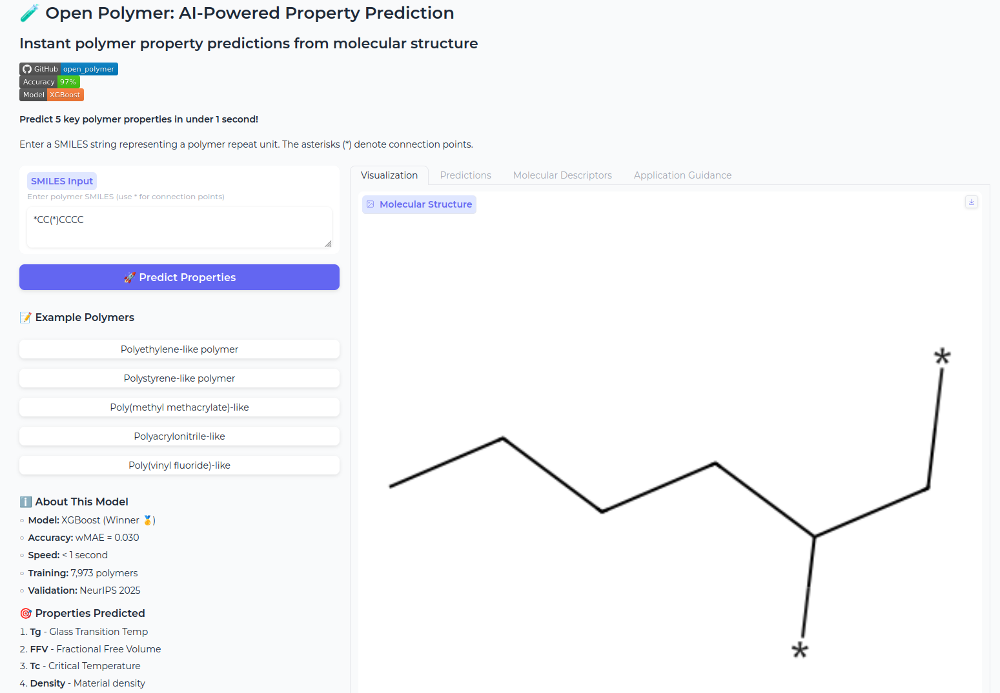
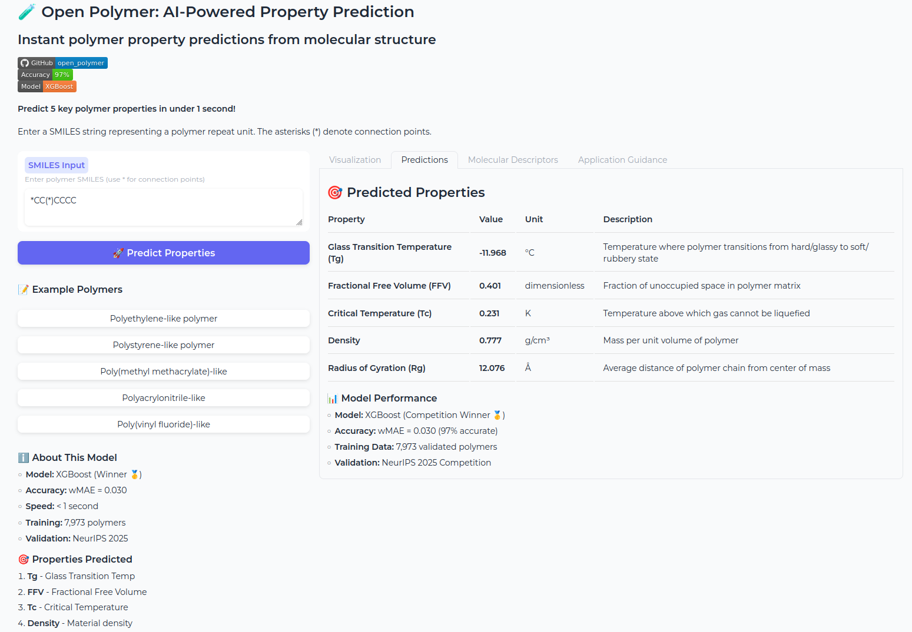
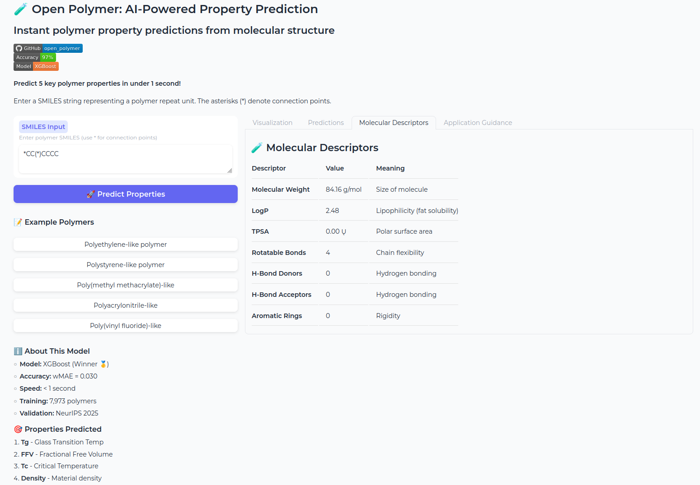
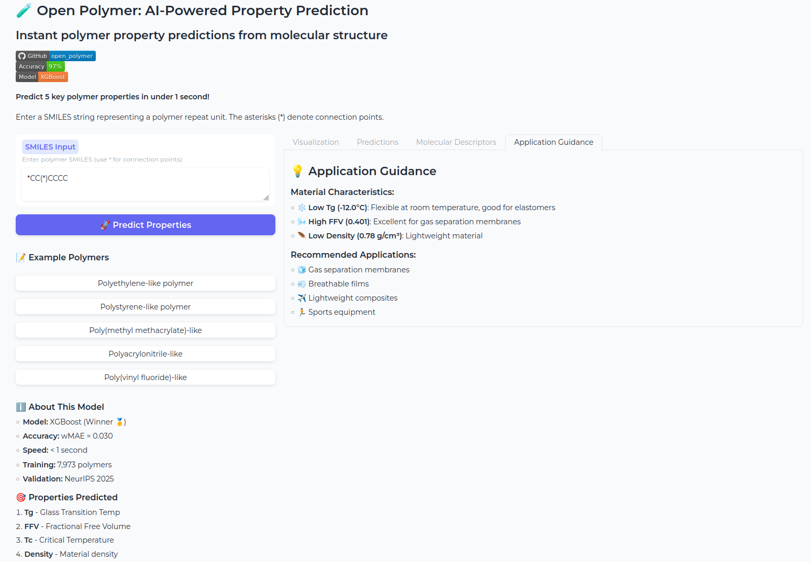

# 🎨 Interactive Web Demo

Beautiful Gradio interface for real-time polymer property prediction.

## Quick Launch

```bash
# From project root
python app/app.py

# Or from app directory
cd app
python app.py
```

Opens at: **http://localhost:7861**

## Features

- 🧪 **Molecule Visualization** - 2D structures with RDKit
- ⚡ **Instant Predictions** - < 100ms per molecule
- 📊 **5 Properties** - Tg, FFV, Tc, Density, Rg
- 🎯 **Application Guidance** - Smart recommendations
- 💡 **Interactive** - Example polymers, tabs, descriptions

## Files

- `app.py` - Main application (350+ lines)
- `LAUNCH_DEMO.md` - Detailed usage guide
- `README.md` - This file

## Requirements

```bash
pip install gradio==4.10.0
```

## Screenshots

### Main Interface

*Clean professional design with SMILES input, example polymer buttons, and model information*

### Visualization Tab

*2D molecular structure rendered with RDKit*

### Predictions Tab

*Predicted properties with units, descriptions, and model accuracy metrics*

### Application Guidance Tab

*Smart recommendations for material applications based on predicted properties*

## Usage Tips

1. **Input SMILES** - Use `*` for connection points
2. **Click Examples** - Quick start with polymers
3. **View Tabs** - Explore all information
4. **Share Results** - Screenshot or export

## Deployment

See `LAUNCH_DEMO.md` for:
- Port configuration
- Authentication setup
- Public sharing
- Production deployment

---

**Ready to predict! 🚀**

