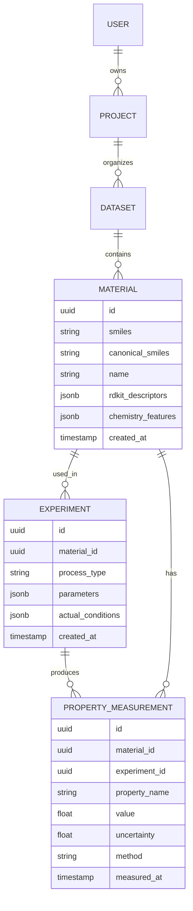

# Lymeric Materials Platform: Comprehensive Implementation Plan

**Vision**: Build an integrated materials discovery ecosystem consisting of (1) a data management platform for polymer/chemistry research and (2) an AI-powered research assistant enhanced with domain-specific knowledge via Claude Skills.

## Executive Summary

This plan outlines the development of two interconnected products:

1. **Lymeric DataManager**: Chemistry-aware data platform for material discovery (inspired by Citrine DataManager)
2. **Lymeric Research Assistant**: "Cursor for Research" - domain-enhanced Claude chatbot using Skills API

The current `open_polymer` repository serves as the **proof of concept** for the third pillar: "Lymeric Physics/AI Services" - demonstrating winning ML solutions for polymer property prediction.

---

## User Review Required

> [!IMPORTANT]
> **Architecture Decision: Monorepo vs Multi-Repo**
> 
> We need to decide on the repository structure:
> - **Option A (Recommended)**: Monorepo with 3 packages (`data-platform/`, `research-assistant/`, `ai-services/`)
> - **Option B**: Separate repositories with shared library for common utilities
> 
> Recommendation: **Option A (Monorepo)** for easier code sharing, unified CI/CD, and simpler dependency management.

> [!IMPORTANT]
> **Technology Stack: Backend Framework**
> 
> For the Data Platform backend:
> - **Option A**: FastAPI (Python) - Better integration with existing ML code, rich chemistry ecosystem (RDKit, Python)
> - **Option B**: Django + DRF - More batteries-included, better admin interface out-of-box
> - **Option C**: Node.js/Express - If team prefers JavaScript full-stack
> 
> Recommendation: **FastAPI** for ML/chemistry integration and async capabilities.

> [!WARNING]
> **Claude Skills Beta Access**
> 
> Claude Skills API is currently in beta (`betas=["skills-2025-10-02"]`). Confirm:
> 1. Do you have API access to Skills beta?
> 2. Budget considerations for API costs (Skills + code execution)

---

## Proposed Changes

### Component 1: Lymeric DataManager (Data Platform)

A chemistry-aware data management platform tailored for materials science research, enabling researchers to store, visualize, and leverage experimental data for AI-driven discovery.

---

#### [NEW] Backend Architecture

#### [NEW] `platform/backend/app/main.py`
**FastAPI application entry point**
- Application initialization with CORS, middleware
- API router registration
- Health check endpoints
- WebSocket support for real-time updates

#### [NEW] `platform/backend/app/api/`
**REST API endpoints**
- `data_ingestion.py` - Upload CSV/Excel, validate chemistry data
- `datasets.py` - CRUD operations for datasets
- `materials.py` - Material records with SMILES validation
- `experiments.py` - Experiment tracking with process parameters
- `properties.py` - Polymer property measurements (Tg, density, etc.)
- `visualizations.py` - Generate plots, correlation matrices
- `ai_services.py` - Integration with prediction models from `open_polymer`

#### [NEW] `platform/backend/app/models/`
**Database ORM models (SQLAlchemy)**
- `material.py` - Material definition with SMILES, structure
- `experiment.py` - Experimental conditions and process history
- `property_measurement.py` - Measured properties with uncertainty
- `dataset.py` - Collections of materials/experiments
- `user.py` - User authentication and permissions
- `project.py` - Research projects and collaboration

#### [NEW] `platform/backend/app/services/`
**Business logic layer**
- `chemistry_service.py` - SMILES canonicalization, descriptor calculation (RDKit)
- `data_quality_service.py` - Outlier detection, completeness checks
- `augmentation_service.py` - Auto-feature engineering (chemistry features from v85)
- `ml_service.py` - Integration with trained models (`models/random_forest_v85_best.pkl`)
- `export_service.py` - Export to CSV, Excel, GEMD-compatible JSON

#### [NEW] `platform/backend/app/core/`
**Core configuration**
- `config.py` - Environment variables, database URLs
- `security.py` - JWT authentication, API key management
- `database.py` - Database connection pooling
- `dependencies.py` - Dependency injection

#### [NEW] `platform/backend/alembic/`
**Database migrations**
- Migration scripts for schema evolution
- Seed data for demo/testing

---

#### [NEW] Frontend Architecture

#### [NEW] `platform/frontend/src/pages/`
**Next.js pages (React)**
- `Dashboard.tsx` - Overview with recent experiments, quick stats
- `DataIngestion.tsx` - Drag-and-drop CSV/Excel upload with preview
- `MaterialsExplorer.tsx` - Search, filter, visualize materials library
- `ExperimentTracking.tsx` - Record experimental conditions, link to materials
- `Predictions.tsx` - Run ML predictions using v85 model, visualize confidence
- `Insights.tsx` - Correlation analysis, feature importance plots
- `Reports.tsx` - Export formatted reports for publications

#### [NEW] `platform/frontend/src/components/`
**Reusable React components**
- `MoleculeViewer.tsx` - 2D structure visualization (RDKit.js or similar)
- `PropertyChart.tsx` - Interactive plots (Plotly.js or Recharts)
- `DataQualityWidget.tsx` - Show completeness, outliers, suggestions
- `FeatureImportance.tsx` - Bar chart of model feature contributions
- `SMILESInput.tsx` - Validated input with live structure preview
- `ExperimentTimeline.tsx` - Process history visualization (like Citrine's material history)

#### [NEW] `platform/frontend/src/hooks/`
**Custom React hooks**
- `useDatasets.ts` - Fetch/manage datasets
- `useMaterials.ts` - Material CRUD operations
- `usePredictions.ts` - ML prediction workflow
- `useChemistry.ts` - SMILES validation, descriptor calculation

---

#### [NEW] Data Model (Chemistry-Aware Schema)

Inspired by Citrine's GEMD (Graphical Expression of Materials Data), but simplified for polymers:



**Key Features:**
1. **SMILES Canonicalization**: Automatic on material creation (using RDKit)
2. **Auto-Descriptors**: Calculate chemistry features (21 features from v85) on ingestion
3. **Process History**: Link materials → experiments → measurements (full provenance)
4. **Flexible Schema**: JSONB fields for custom properties without schema migration

---

#### [NEW] Key Features (MVP)

**1. Data Ingestion & Validation**
- Upload CSV/Excel with SMILES column
- Auto-detect property columns (Tg, density, FFV, etc.)
- Validate SMILES with RDKit, flag invalid structures
- Auto-calculate 21 chemistry features from v85 model

**2. Data Quality Dashboard**
- Completeness heatmap (which properties are measured?)
- Outlier detection (Z-score, isolation forest)
- Distribution plots per property
- Missing data patterns

**3. Chemistry-Aware Search**
- Search by SMILES (exact or substructure)
- Filter by property ranges (e.g., Tg > 200°C)
- Similarity search (Tanimoto coefficient)

**4. ML Integration**
- One-click predictions using v85 Random Forest model
- Confidence intervals for predictions
- Feature importance visualization
- "What-if" analysis (change SMILES, see predicted properties)

**5. Visualization & Reporting**
- Property correlation matrix
- 2D structure display for materials
- Export reports with visualizations

---

### Component 2: Lymeric Research Assistant (Claude-Powered Chatbot)

"Cursor for Research" - An AI research assistant enhanced with materials science domain knowledge via Claude Skills, enabling material scientists to query data, generate insights, and automate research workflows.

---

#### [NEW] Claude Skills Architecture

#### [NEW] `research-assistant/skills/`
**Custom Claude Skills (domain expertise)**

Each skill is a directory with:
- `skill.yaml` - Skill metadata and configuration
- `instructions.md` - Domain-specific instructions for Claude
- `examples/` - Few-shot examples for better performance
- `tools/` - Optional Python utilities

**Skill 1: Polymer Property Expert**
#### [NEW] `research-assistant/skills/polymer_property_expert/`
- **Purpose**: Expert knowledge on polymer physics (Tg, crystallization, free volume)
- **Instructions**: 
  - Explain property-structure relationships
  - Suggest experiments based on desired properties
  - Interpret property ranges, typical values
- **Examples**: "What SMILES features increase Tg?" → "Aromatic rings, H-bonding groups (O, N)"

**Skill 2: SMILES Chemistry Expert**
#### [NEW] `research-assistant/skills/smiles_chemistry_expert/`
- **Purpose**: Interpret, validate, and explain SMILES representations
- **Instructions**:
  - Parse SMILES to identify functional groups
  - Suggest SMILES modifications for specific properties
  - Explain canonicalization and molecular features
- **Examples**: "What does CC(C)C mean?" → "Isobutane: branched 4-carbon alkane"

**Skill 3: Experimental Design Assistant**
#### [NEW] `research-assistant/skills/experimental_design/`
- **Purpose**: Suggest experiments using design of experiments (DOE)
- **Instructions**:
  - Generate factorial designs
  - Suggest optimal sampling strategies
  - Recommend controls and replicates
- **Examples**: "Design experiments to test Tg vs aromatic content" → Latin hypercube sampling plan

**Skill 4: Data Analysis & Visualization**
#### [NEW] `research-assistant/skills/data_analysis/`
- **Purpose**: Generate Python code for analysis (using code execution)
- **Instructions**:
  - Correlation analysis
  - Feature importance plots
  - Statistical tests (t-test, ANOVA)
- **Libraries**: pandas, numpy, matplotlib, seaborn, scipy
- **Examples**: "Plot Tg vs density from dataset X" → generates matplotlib code

**Skill 5: Literature Search & Summarization**
#### [NEW] `research-assistant/skills/literature_expert/`
- **Purpose**: Summarize polymer science concepts from literature
- **Instructions**:
  - Explain polymer chemistry terminology
  - Cite typical property ranges from known polymers
  - Suggest relevant research directions
- **Knowledge**: Pre-loaded with polymer science textbook summaries

---

#### [NEW] Backend Integration

#### [NEW] `research-assistant/backend/app/main.py`
**FastAPI application for chatbot API**
- WebSocket endpoint for real-time chat
- Message history management
- Integration with Claude Skills API

#### [NEW] `research-assistant/backend/app/services/claude_service.py`
**Claude API integration**
```python
class ClaudeSkillsService:
    def __init__(self):
        self.client = anthropic.Anthropic(api_key=os.getenv("ANTHROPIC_API_KEY"))
        self.skill_ids = {
            "polymer_expert": self._load_skill("polymer_property_expert"),
            "smiles_expert": self._load_skill("smiles_chemistry_expert"),
            "exp_design": self._load_skill("experimental_design"),
            "data_analysis": self._load_skill("data_analysis"),
            "literature": self._load_skill("literature_expert")
        }
    
    def chat(self, user_message: str, conversation_history: list):
        response = self.client.beta.messages.create(
            model="claude-sonnet-4-5-20250929",
            max_tokens=4096,
            betas=["code-execution-2025-08-25", "skills-2025-10-02"],
            container={
                "skills": [
                    {"type": "custom", "skill_id": skill_id, "version": "latest"}
                    for skill_id in self.skill_ids.values()
                ]
            },
            messages=conversation_history + [{"role": "user", "content": user_message}],
            tools=[{"type": "code_execution_20250825", "name": "code_execution"}]
        )
        return response
```

#### [NEW] `research-assistant/backend/app/services/data_platform_service.py`
**Integration with DataManager**
- Query materials/experiments from database
- Fetch datasets for analysis
- Run predictions via ML service
- Example: "Show me all materials with Tg > 200°C" → SQL query → return results to Claude

---

#### [NEW] Frontend (Chat Interface)

#### [NEW] `research-assistant/frontend/src/pages/Chat.tsx`
**Main chat interface**
- Message thread (user + assistant)
- Input box with multi-line support
- File attachment (CSV for analysis)
- Code execution results inline
- Visualization rendering (plots from code execution)

#### [NEW] `research-assistant/frontend/src/components/`
- `ChatMessage.tsx` - Single message bubble
- `CodeBlock.tsx` - Syntax-highlighted code from Skills
- `ChartRenderer.tsx` - Render matplotlib/plotly outputs
- `SkillSelector.tsx` - Toggle which skills to activate
- `ConversationHistory.tsx` - Past conversations

---

#### [NEW] Key Features (MVP)

**1. Context-Aware Conversations**
- Remember previous queries in session
- Access to user's datasets from DataManager
- Multi-turn clarification questions

**2. Domain-Enhanced Responses**
- Polymer physics explanations using Skill instructions
- SMILES interpretation and suggestions
- Literature-backed recommendations

**3. Code Execution for Analysis**
- Generate Python code for data analysis
- Execute in safe sandbox (Claude's code execution)
- Display plots inline
- Download results (CSV, images)

**4. Integration with DataManager**
- "Analyze dataset X" → fetch from DB, run analysis
- "Predict Tg for SMILES Y" → call ML service, return result with confidence
- "Find similar materials" → similarity search, return list

**5. Research Workflow Automation**
- "Design experiments for optimizing Tg" → DOE plan + export
- "Compare my results to literature" → statistical comparison
- "Generate report for materials A, B, C" → formatted document

---

### Component 3: AI Services Integration (Existing `open_polymer`)

Leverage existing ML infrastructure as the **AI engine** for both platforms.

---

#### [MODIFY] `src/train_v85_best.py`
**Add API-friendly model serving**
- Export model metadata (feature names, version, training date)
- Save feature scalers separately for inference
- Add model versioning

#### [NEW] `src/api_predictor.py`
**Prediction API wrapper**
```python
class PolymerPredictor:
    def __init__(self, model_path: str):
        self.models = joblib.load(model_path)
        self.feature_extractor = ChemistryFeatureExtractor()
    
    def predict(self, smiles: str) -> dict:
        """Predict all properties for a SMILES string"""
        features = self.feature_extractor.extract(smiles)
        predictions = {}
        for property_name, model in self.models.items():
            pred = model.predict([features])[0]
            predictions[property_name] = {
                "value": pred,
                "confidence": self._calculate_confidence(model, features)
            }
        return predictions
```

#### [MODIFY] `app/app.py`
**Enhance Gradio app for embedding**
- Add API mode (return JSON instead of UI)
- Expose REST endpoints via `app.launch(share=False, api_mode=True)`
- Or refactor to separate Gradio UI from prediction logic

---

### Technology Stack

#### Backend (Data Platform + Research Assistant)
| Component | Technology | Rationale |
|-----------|-----------|-----------|
| **API Framework** | FastAPI | Async, auto-docs, ML-friendly |
| **Database** | PostgreSQL + JSONB | Flexible schema, chemistry data |
| **ORM** | SQLAlchemy 2.0 | Python standard, async support |
| **Chemistry** | RDKit | SMILES validation, descriptors |
| **ML Framework** | scikit-learn, XGBoost | Existing models from v85 |
| **Task Queue** | Celery + Redis | Long-running predictions |
| **Auth** | JWT (FastAPI-Users) | Secure API access |

#### Frontend (Data Platform + Research Assistant)
| Component | Technology | Rationale |
|-----------|-----------|-----------|
| **Framework** | Next.js 14 (React) | SSR, API routes, TypeScript |
| **UI Library** | Tailwind CSS + shadcn/ui | Modern, customizable |
| **Charts** | Recharts + Plotly.js | Interactive chemistry plots |
| **Molecules** | RDKit.js (WASM) | 2D structure rendering |
| **State** | React Query + Zustand | Server state + local state |
| **WebSocket** | Socket.io-client | Real-time chat |

#### AI Integration
| Component | Technology | Rationale |
|-----------|-----------|-----------|
| **Claude API** | Anthropic Python SDK | Skills beta access |
| **Skills Storage** | S3 / Local filesystem | Skill package files |
| **Code Execution** | Claude's built-in | Sandboxed Python execution |

#### Infrastructure (Future)
| Component | Technology | Rationale |
|-----------|-----------|-----------|
| **Containers** | Docker + Compose | Dev environment parity |
| **Orchestration** | Kubernetes (optional) | If multi-tenant scale |
| **Monitoring** | Prometheus + Grafana | Metrics, ML model drift |
| **Logging** | ELK Stack | Centralized logs |

---

### Directory Structure (Monorepo)

```
lymeric-platform/
├── README.md                          # Overview of monorepo
├── docker-compose.yml                 # Local dev environment
├── .github/workflows/                 # CI/CD pipelines
│
├── packages/
│   ├── data-platform/                 # Component 1: DataManager
│   │   ├── backend/                   # FastAPI backend
│   │   │   ├── app/
│   │   │   │   ├── main.py
│   │   │   │   ├── api/               # REST endpoints
│   │   │   │   ├── models/            # SQLAlchemy models
│   │   │   │   ├── services/          # Business logic
│   │   │   │   └── core/              # Config, DB, auth
│   │   │   ├── tests/
│   │   │   ├── alembic/               # Migrations
│   │   │   ├── Dockerfile
│   │   │   └── requirements.txt
│   │   │
│   │   └── frontend/                  # Next.js frontend
│   │       ├── src/
│   │       │   ├── pages/             # Page components
│   │       │   ├── components/        # UI components
│   │       │   ├── hooks/             # Custom hooks
│   │       │   ├── lib/               # Utilities
│   │       │   └── styles/            # CSS
│   │       ├── public/
│   │       ├── Dockerfile
│   │       └── package.json
│   │
│   ├── research-assistant/            # Component 2: Chatbot
│   │   ├── backend/                   # FastAPI + Claude API
│   │   │   ├── app/
│   │   │   │   ├── main.py
│   │   │   │   ├── services/
│   │   │   │   │   ├── claude_service.py
│   │   │   │   │   └── data_platform_service.py
│   │   │   │   └── websocket/         # Chat WebSocket
│   │   │   └── requirements.txt
│   │   │
│   │   ├── frontend/                  # Chat UI
│   │   │   ├── src/
│   │   │   │   ├── pages/Chat.tsx
│   │   │   │   └── components/
│   │   │   └── package.json
│   │   │
│   │   └── skills/                    # Claude Skills definitions
│   │       ├── polymer_property_expert/
│   │       │   ├── skill.yaml
│   │       │   ├── instructions.md
│   │       │   └── examples/
│   │       ├── smiles_chemistry_expert/
│   │       ├── experimental_design/
│   │       ├── data_analysis/
│   │       └── literature_expert/
│   │
│   ├── ai-services/                   # Component 3: ML Models (existing open_polymer)
│   │   ├── src/                       # Training scripts
│   │   ├── models/                    # Trained models
│   │   ├── data/                      # Datasets
│   │   ├── api/                       # NEW: Model serving API
│   │   │   ├── predictor.py
│   │   │   └── main.py
│   │   └── requirements.txt
│   │
│   └── shared/                        # Shared utilities
│       ├── python/                    # Shared Python code
│       │   ├── chemistry/             # RDKit helpers
│       │   ├── validation/            # Data validation
│       │   └── config/                # Shared config
│       └── typescript/                # Shared TS code
│           ├── types/                 # API types
│           └── utils/                 # Common utils
│
├── scripts/                           # Dev/ops scripts
│   ├── setup_dev.sh                   # Setup local environment
│   ├── seed_database.py               # Load demo data
│   └── deploy.sh                      # Deployment script
│
└── docs/                              # Documentation
    ├── architecture.md
    ├── api_reference.md
    ├── skills_guide.md
    └── deployment.md
```

---

### Development Roadmap

#### Phase 1: Foundation (Weeks 1-4)

**Week 1-2: Data Platform MVP**
- [ ] Setup monorepo structure
- [ ] PostgreSQL schema + Alembic migrations
- [ ] FastAPI backend skeleton (health checks, CORS)
- [ ] Material CRUD API with SMILES validation
- [ ] Basic Next.js frontend with Material list view
- [ ] RDKit integration for canonicalization

**Week 3-4: ML Integration**
- [ ] Refactor `src/train_v85_best.py` for API serving
- [ ] Create `api_predictor.py` wrapper
- [ ] Prediction API endpoint in data-platform backend
- [ ] Frontend: Prediction page with SMILES input
- [ ] Display predictions with confidence intervals

#### Phase 2: Data Platform Features (Weeks 5-8)

**Week 5-6: Data Ingestion & Quality**
- [ ] CSV/Excel upload endpoint with validation
- [ ] Auto-extract 21 chemistry features
- [ ] Data quality dashboard (completeness, outliers)
- [ ] Visualization components (charts, correlation matrix)

**Week 7-8: Advanced Features**
- [ ] Experiment tracking (process history)
- [ ] Property measurement CRUD
- [ ] Material search (SMILES, property filters)
- [ ] Export functionality (CSV, reports)

#### Phase 3: Research Assistant (Weeks 9-12)

**Week 9-10: Claude Skills Setup**
- [ ] Create 5 custom Skills (polymer expert, SMILES, etc.)
- [ ] Skills API integration in backend
- [ ] Test Skills with Claude API beta
- [ ] Prompt engineering for domain accuracy

**Week 11-12: Chat Interface**
- [ ] Next.js chat UI with WebSocket
- [ ] Message history persistence
- [ ] Code execution rendering (inline plots)
- [ ] Integration with DataManager (query datasets)

#### Phase 4: Polish & Deployment (Weeks 13-16)

**Week 13-14: Testing & Refinement**
- [ ] Unit tests for backend services
- [ ] Integration tests for API endpoints
- [ ] E2E tests for critical flows (upload → predict → visualize)
- [ ] Skills accuracy evaluation

**Week 15-16: Deployment**
- [ ] Docker Compose for local dev
- [ ] Kubernetes manifests (if needed)
- [ ] CI/CD pipelines (GitHub Actions)
- [ ] Monitoring setup (Prometheus)
- [ ] Documentation finalization

---

## Verification Plan

### Automated Tests

#### 1. Backend Unit Tests
**Data Platform Backend**
```bash
cd packages/data-platform/backend
pytest tests/unit/
```
- Test SMILES validation (valid, invalid, edge cases)
- Test chemistry feature extraction (21 features)
- Test model predictions (mock model, verify output format)
- Test data quality checks (outlier detection)

**Research Assistant Backend**
```bash
cd packages/research-assistant/backend
pytest tests/unit/
```
- Test Claude API integration (mocked responses)
- Test conversation history management
- Test DataManager query service

#### 2. API Integration Tests
**Data Platform**
```bash
cd packages/data-platform/backend
pytest tests/integration/ --api
```
- POST `/api/materials` with SMILES → verify canonicalization
- GET `/api/materials?tg_min=200` → verify filtering
- POST `/api/predict` with SMILES → verify prediction response
- POST `/api/upload/csv` → verify batch ingestion

**Research Assistant**
```bash
cd packages/research-assistant/backend
pytest tests/integration/ --api
```
- WebSocket chat flow (connect → send message → receive response)
- Skills activation test (verify skill_ids in API call)
- DataManager integration (chat message triggers DB query)

#### 3. End-to-End Tests (Playwright)
```bash
cd packages/data-platform/frontend
npm run test:e2e
```
- **Flow 1: Upload and Predict**
  1. Navigate to `/data-ingestion`
  2. Upload `tests/fixtures/sample_materials.csv`
  3. Verify table preview shows SMILES column
  4. Click "Import"
  5. Navigate to `/predictions`
  6. Enter SMILES "CC(C)C"
  7. Click "Predict"
  8. Verify Tg, density predictions displayed
  
- **Flow 2: Chat with Research Assistant**
  1. Navigate to `/chat`
  2. Type "What affects glass transition temperature?"
  3. Verify response mentions "aromatic rings", "H-bonding"
  4. Type "Show materials with Tg > 200°C from my database"
  5. Verify table with results appears

### Manual Verification

#### 1. Data Platform Smoke Test
**Setup**:
```bash
docker-compose up -d
npm run seed:database  # Load demo data
```

**Test Steps**:
1. Open browser to `http://localhost:3000`
2. **Dashboard**: Verify demo materials count shows (e.g., "127 materials")
3. **Materials Explorer**: 
   - Search for benzene ring (search "c1ccccc1")
   - Verify results show aromatic polymers
4. **Predictions**:
   - Input SMILES: `CC(C)(C)c1ccc(O)cc1` (para-tert-butylphenol)
   - Click "Predict All Properties"
   - Verify: Tg ~50-80°C, Density ~1.0-1.2 g/cm³ (reasonable for phenolic)
5. **Upload**:
   - Download sample CSV from repo (`tests/fixtures/sample_upload.csv`)
   - Drag-and-drop to upload area
   - Verify preview shows correct columns
   - Click "Import" → verify success message

**Expected Result**: All features work without errors, predictions are chemically reasonable.

#### 2. Research Assistant Smoke Test
**Test Steps**:
1. Open `http://localhost:3001/chat`
2. **Polymer Expert Skill**:
   - Ask: "Explain why aromatic rings increase Tg"
   - Expected: Mentions rigidity, restricted rotation, π-π stacking
3. **SMILES Expert Skill**:
   - Ask: "What is the structure of CC(C)O?"
   - Expected: Describes isopropanol, shows 2D structure
4. **Data Analysis Skill**:
   - Ask: "Plot Tg vs density for my materials"
   - Expected: Generates Python code, shows matplotlib scatter plot
5. **Integration Test**:
   - Ask: "Find materials with high Tg and predict properties for similar SMILES"
   - Expected: Queries database, runs predictions, shows table

**Expected Result**: Skills activate correctly, responses are domain-accurate, code executes successfully.

#### 3. Claude Skills Validation
**Polymer Expert Accuracy**:
- Prepare 10 domain questions (e.g., "What is free volume fraction?")
- Compare answers to polymer science textbook
- Target: 9/10 answers should be factually correct

**SMILES Parsing**:
- Test 20 SMILES strings (simple to complex)
- Verify correct functional group identification
- Target: 100% accuracy on valid SMILES

### Performance Tests

#### Load Testing (Optional, post-MVP)
```bash
# Using Locust
cd packages/data-platform/backend
locust -f tests/load/test_prediction_api.py
```
- Simulate 100 concurrent users predicting properties
- Target: < 2s response time at p95

---

## Next Steps

1. **User Confirmation**:
   - Approve monorepo architecture
   - Confirm FastAPI as backend framework
   - Verify access to Claude Skills beta API
   
2. **Repository Setup**:
   - Create `lymeric-platform` repository
   - Migrate `open_polymer` to `packages/ai-services/`
   - Setup CI/CD scaffolding

3. **Kick-off Development**:
   - Week 1: Database schema design workshop
   - Week 2: API contract definition (OpenAPI spec)
   - Week 3: Begin parallel frontend/backend development

---

## References

- **Citrine DataManager**: https://citrine.io/platform/citrine-datamanager/
- **Claude Skills Guide**: https://docs.claude.com/en/docs/build-with-claude/skills-guide
- **GEMD Data Model**: https://citrineinformatics.github.io/gemd-docs/
- **RDKit Documentation**: https://www.rdkit.org/docs/
- **Current Polymer ML Solution**: `/Users/jihwan/Downloads/open_polymer` (v85 - 1st place Kaggle)
