## Pseudo-Label Generation for Polymer Property Prediction

This module generates high-quality pseudo-labels for unlabeled polymer data using an ensemble of pre-trained models (BERT + Uni-Mol). The generated labels are used to augment training data, significantly improving the final Random Forest model performance.

### 🎯 Goal

Generate 50,000 high-quality pseudo-labels for polymer properties (Tg, FFV, Tc, Density, Rg) using an ensemble approach:

```
Original Training Data (7,973 samples)
           ↓
BERT Predictions (50K)  +  Uni-Mol Predictions (50K)
           ↓
    Ensemble Average
           ↓
50K Pseudo-Labels (+ Tg Transformation)
           ↓
Augmented Dataset (57,973 samples)
           ↓
Train v85 Random Forest (0.07533 Private Score! 🥇)
```

---

## Quick Start

### 1. Environment Setup (Required!)

```bash
# Create isolated conda environment
conda create -n pseudolabel_env python=3.10 -y
conda activate pseudolabel_env

# Install dependencies
pip install torch torchvision torchaudio --index-url https://download.pytorch.org/whl/cpu
pip install transformers pandas scikit-learn numpy tqdm rdkit autogluon

# Verify Apple Silicon support
python -c "import torch; print(f'MPS available: {torch.backends.mps.is_available()}')"
```

**Why separate environment?**
- Avoids conflicts with `torch_geometric` (requires specific PyTorch version)
- Cleaner dependency management for BERT/Uni-Mol
- Includes AutoGluon and RDKit for seamless pipeline execution
- **NOTE:** This environment is used by BOTH `pseudolabel/` and `AutoGluon/` folders!
- Works seamlessly on Apple Silicon (MPS acceleration)

### 2. Quick Generation (5 min total)

```bash
# Activate environment
conda activate pseudolabel_env

# Generate BERT pseudo-labels (~5 min)
python pseudolabel/train_bert_heads.py
python pseudolabel/generate_with_bert.py

# Generate Uni-Mol pseudo-labels (~2 min)
python pseudolabel/train_unimol_heads.py
python pseudolabel/generate_with_unimol.py

# Create ensemble (~1 min)
python pseudolabel/ensemble_bert_unimol.py

# Result: pi1m_pseudolabels_ensemble_2models.csv (50K samples)
```

---

## Complete Workflow

### Step 1: Train BERT Prediction Heads

**Purpose:** Learn property-specific prediction heads on top of BERT embeddings

**Command:**
```bash
python pseudolabel/train_bert_heads.py \
    --epochs 10 \
    --batch_size 32 \
    --learning_rate 0.001
```

**What it does:**
1. Loads 7,973 training samples
2. Canonicalizes SMILES using RDKit
3. Loads pre-trained BERT model (`unikei/bert-base-smiles`)
4. Generates 768-dimensional embeddings for all samples
5. Trains 5 separate prediction heads (one per property) using:
   - 10 epochs
   - MSE loss
   - Adam optimizer (lr=0.001)
   - Batch size 32
6. Saves trained heads + scalers to `models/bert_heads/prediction_heads.pkl`

**Output:**
- `models/bert_heads/prediction_heads.pkl` (2.8 MB)
- Contains 5 trained heads + StandardScaler for each property

**Time:** ~4-5 minutes (mostly BERT embedding generation)

**Device:** Automatic detection (CUDA > MPS > CPU)

### Step 2: Generate BERT Pseudo-Labels

**Purpose:** Use trained BERT heads to predict properties for 50K unlabeled SMILES

**Command:**
```bash
python pseudolabel/generate_with_bert.py \
    --input_data data/PI1M_50000_v2.1.csv \
    --bert_model_name_or_path unikei/bert-base-smiles \
    --heads_path models/bert_heads/prediction_heads.pkl \
    --output_path pseudolabel/pi1m_pseudolabels_bert.csv
```

**What it does:**
1. Loads 50K SMILES from input CSV
2. Canonicalizes SMILES
3. Loads pre-trained BERT model
4. Generates embeddings in batches
5. Uses trained heads to predict all 5 properties
6. Applies Tg transformation: `Tg_transformed = (9/5) * Tg + 45`
7. Saves results to CSV

**Output:**
- `pseudolabel/pi1m_pseudolabels_bert.csv` (6.9 MB)
- 50,001 rows (header + 50K samples)
- Columns: SMILES, Tg, FFV, Tc, Density, Rg

**Time:** ~5 minutes

**Statistics:**
```
Tg:      Mean=160.19, Std=7.27
FFV:     Mean=0.361, Std=0.023
Tc:      Mean=0.223, Std=0.048
Density: Mean=1.055, Std=0.086
Rg:      Mean=16.13, Std=0.938
```

### Step 3: Setup Uni-Mol (First Time Only)

**Download Checkpoint:**

The Uni-Mol checkpoint must be downloaded from Hugging Face:

```bash
# Option 1: Manual download
mkdir -p pseudolabel
cd pseudolabel
# Visit: https://huggingface.co/dptech/Uni-Mol2/tree/main/modelzoo/84M
# Download "unimol2_checkpoint.pt" manually or use:
wget https://huggingface.co/dptech/Uni-Mol2/resolve/main/modelzoo/84M/unimol2_checkpoint.pt -O unimol_checkpoint.pt

# Option 2: Using git-lfs (if available)
git clone https://huggingface.co/dptech/Uni-Mol2
cd Uni-Mol2/modelzoo/84M
cp unimol2_checkpoint.pt /path/to/pseudolabel/unimol_checkpoint.pt
```

**File:** `pseudolabel/unimol_checkpoint.pt` (should be ~600-800 MB)

### Step 4: Train Uni-Mol Prediction Heads

**Purpose:** Learn property-specific prediction heads on top of Uni-Mol embeddings

**Command:**
```bash
python pseudolabel/train_unimol_heads.py \
    --unimol_model_path pseudolabel/unimol_checkpoint.pt \
    --epochs 50 \
    --batch_size 32
```

**What it does:**
1. Loads training data
2. Loads Uni-Mol checkpoint
3. Generates 512-dimensional embeddings
4. Trains 5 separate heads using:
   - 50 epochs
   - MSE loss
   - Adam optimizer (lr=0.001)
5. Saves to `models/unimol_heads/prediction_heads.pkl`

**Output:**
- `models/unimol_heads/prediction_heads.pkl` (1.2 MB)

**Time:** ~3-4 minutes

### Step 5: Generate Uni-Mol Pseudo-Labels

**Purpose:** Generate predictions using trained Uni-Mol heads

**Command:**
```bash
python pseudolabel/generate_with_unimol.py \
    --input_data data/PI1M_50000_v2.1.csv \
    --unimol_model_path pseudolabel/unimol_checkpoint.pt \
    --heads_path models/unimol_heads/prediction_heads.pkl \
    --output_path pseudolabel/pi1m_pseudolabels_unimol.csv
```

**Output:**
- `pseudolabel/pi1m_pseudolabels_unimol.csv` (5.1 MB)

**Time:** ~2 minutes

**Statistics:**
```
Tg:      Mean=224.51, Std=112.02
FFV:     Mean=0.368, Std=0.011
Tc:      Mean=0.254, Std=0.052
Density: Mean=0.985, Std=0.079
Rg:      Mean=16.31, Std=2.51
```

### Step 6: Ensemble BERT + Uni-Mol

**Purpose:** Combine predictions from both models by averaging

**Command:**
```bash
python pseudolabel/ensemble_bert_unimol.py \
    --bert_labels pseudolabel/pi1m_pseudolabels_bert.csv \
    --unimol_labels pseudolabel/pi1m_pseudolabels_unimol.csv \
    --output_path pseudolabel/pi1m_pseudolabels_ensemble_2models.csv
```

**What it does:**
1. Loads both prediction files
2. Takes element-wise mean for each property
3. Saves ensemble results

**Output:**
- `pseudolabel/pi1m_pseudolabels_ensemble_2models.csv` (6.8 MB)

**Time:** ~1 minute

**Ensemble Statistics:**
```
Tg:      Mean=192.35, Std=56.13  (balanced variance)
FFV:     Mean=0.364, Std=0.013  (stable)
Tc:      Mean=0.238, Std=0.035  (conservative)
Density: Mean=1.020, Std=0.059  (balanced)
Rg:      Mean=16.22, Std=1.34   (stable)
```

---

## Workflow Diagram

```mermaid
graph LR
    A["50K SMILES<br/>(PI1M_50000_v2.1.csv)"] 
    
    A --> B["train_bert_heads.py<br/>(Step 1)"]
    B --> B1["models/bert_heads/<br/>prediction_heads.pkl"]
    
    A --> C["generate_with_bert.py<br/>(Step 2)"]
    B1 --> C
    C --> C1["pi1m_pseudolabels_bert.csv<br/>(6.9 MB)"]
    
    A --> D["train_unimol_heads.py<br/>(Step 3)"]
    D --> D1["models/unimol_heads/<br/>prediction_heads.pkl"]
    
    A --> E["generate_with_unimol.py<br/>(Step 4)"]
    D1 --> E
    E --> E1["pi1m_pseudolabels_unimol.csv<br/>(5.1 MB)"]
    
    C1 --> F["ensemble_bert_unimol.py<br/>(Step 5)"]
    E1 --> F
    F --> F1["pi1m_pseudolabels_ensemble_2models.csv<br/>(6.8 MB)"]
    
    F1 --> G["Use in train_v85_best.py<br/>Augment training data"]
    G --> H["Train Random Forest<br/>0.07533 Private Score 🥇"]
```



---

## Model Comparison

### BERT (`unikei/bert-base-smiles`)

**Strengths:**
- ✅ Conservative predictions (lower variance)
- ✅ Fast to train (10 epochs)
- ✅ Stable FFV predictions
- ✅ Good Tg stability

**Weaknesses:**
- ❌ May miss diversity
- ❌ Lower Tg variance might underestimate some properties

**Best for:** Stable, reliable baseline predictions

### Uni-Mol (dptech/Uni-Mol2)

**Strengths:**
- ✅ Molecule-specific architecture
- ✅ Higher diversity (captures edge cases)
- ✅ Better Tg variance

**Weaknesses:**
- ❌ Higher variance (may include noise)
- ❌ Requires checkpoint download (~600 MB)
- ❌ Slower training (50 epochs)

**Best for:** Capturing molecular diversity

### Ensemble (BERT + Uni-Mol Average)

**Strengths:**
- ✅ **Best of both worlds!**
- ✅ Balanced variance
- ✅ Robust to individual model errors
- ✅ Reduces noise while maintaining diversity

**Statistics:**
- Tg std: 56.13 (between BERT 7.27 and Uni-Mol 112.02) ✨
- FFV std: 0.013 (stable)
- Better generalization than either model alone

**Result:** Used in v85 for 0.07533 private score! 🥇

---

## Quality Metrics

### Training Data Used
- **Original:** 7,973 samples with labels
- **Pseudo-generated:** 50,000 samples without labels
- **Total augmented:** 57,973 samples (+626% increase)

### Sample Distribution
```
Property   Original  Augmented  Increase
Tg         511       52,435     +10,158%
FFV        7,030     57,018     +710%
Tc         737       50,855     +5,793%
Density    613       50,601     +7,154%
Rg         614       50,602     +7,153%
```

### Validation Approach
1. Train on original 7,973 samples only
2. Generate predictions for 50K unknown SMILES
3. Ensemble multiple models for robustness
4. Apply domain-specific transformation (Tg)
5. Validate final model performance on test set

---

## Troubleshooting

### Issue: "RDKit not available"
```
⚠️  RDKit not available - SMILES canonicalization will be skipped
```
**Solution:**
```bash
conda activate pseudolabel_env
pip install rdkit
```

### Issue: "MPS not available" (Apple Silicon)
```
Using device: cpu
```
**Solution:** Already falls back to CPU automatically. MPS is optional.

### Issue: "Uni-Mol checkpoint not found"
```
❌ File not found at pseudolabel/unimol_checkpoint.pt
Download from: https://huggingface.co/dptech/Uni-Mol2/tree/main/modelzoo/84M
```
**Solution:** Download and place checkpoint in `pseudolabel/` directory

### Issue: "BERT model download fails"
```
❌ Failed to load BERT: Connection error
```
**Solution:** Check internet connection or pre-download:
```bash
python -c "from transformers import AutoModelForPreTraining; AutoModelForPreTraining.from_pretrained('unikei/bert-base-smiles')"
```

---

## Performance Impact

### Before Pseudo-Labels (v53)
```
Private: 0.07874
Public:  0.10354
Models:  Random Forest + Data augmentation
```

### After Pseudo-Labels (v85)
```
Private: 0.07533  ← 4.3% improvement! 🥇
Public:  0.08139
Models:  Random Forest + Pseudo-labels + Canonicalization
```

**Key Finding:** Combining BERT + Uni-Mol ensemble pseudo-labels with SMILES canonicalization achieved **TIED WITH 1ST PLACE** on Kaggle leaderboard!

---

## Advanced Usage

### Generate Only BERT Labels
```bash
python pseudolabel/train_bert_heads.py
python pseudolabel/generate_with_bert.py
# Output: pi1m_pseudolabels_bert.csv
```

### Generate Only Uni-Mol Labels
```bash
python pseudolabel/train_unimol_heads.py
python pseudolabel/generate_with_unimol.py
# Output: pi1m_pseudolabels_unimol.csv
```

### Custom Ensemble Weights
Edit `ensemble_bert_unimol.py` to use weighted average instead of simple mean:
```python
# Line: ensemble_vals = np.nanmean([bert_vals, unimol_vals], axis=0)
# Change to:
ensemble_vals = np.average(
    [bert_vals, unimol_vals],
    axis=0,
    weights=[0.6, 0.4]  # BERT 60%, Uni-Mol 40%
)
```

---

## File Reference

| File | Purpose | Input | Output |
|------|---------|-------|--------|
| `train_bert_heads.py` | Train BERT heads | `train.csv` | `bert_heads/prediction_heads.pkl` |
| `generate_with_bert.py` | BERT predictions | `PI1M_50000_v2.1.csv` + heads | `pi1m_pseudolabels_bert.csv` |
| `train_unimol_heads.py` | Train Uni-Mol heads | `train.csv` | `unimol_heads/prediction_heads.pkl` |
| `generate_with_unimol.py` | Uni-Mol predictions | `PI1M_50000_v2.1.csv` + heads | `pi1m_pseudolabels_unimol.csv` |
| `ensemble_bert_unimol.py` | Average predictions | Both CSV files | `pi1m_pseudolabels_ensemble_2models.csv` |

---

## Next Steps

1. **Generate pseudo-labels** (you are here! ✨)
2. **Use in training:** See `src/train_v85_best.py`
3. **Submit to Kaggle:** Use the ensemble labels for production model
4. **(Optional) Add AutoGluon:** Extend ensemble to 3+ models

---

## Important: Using `pseudolabel_env` Across the Project

**Both `pseudolabel/` and `AutoGluon/` folders use the same environment:**

```bash
# Always activate this environment before running scripts in either folder
conda activate pseudolabel_env

# Pseudo-label generation
python pseudolabel/train_bert_heads.py
python pseudolabel/generate_with_bert.py

# AutoGluon training & inference
python AutoGluon/train_autogluon_production.py
python AutoGluon/train_v85_best.py
```

**Why both folders share `pseudolabel_env`:**
- ✅ Both use PyTorch, transformers, and RDKit
- ✅ Both use pandas and scikit-learn
- ✅ AutoGluon is installed in `pseudolabel_env`
- ✅ Simplifies dependency management across the pipeline
- ✅ Avoids conflicts and ensures reproducibility

---

**Status:** ✅ Complete | **Last Updated:** Nov 14, 2025 | **Final Score:** 0.07533 Private (🥇 Tied 1st Place!)
