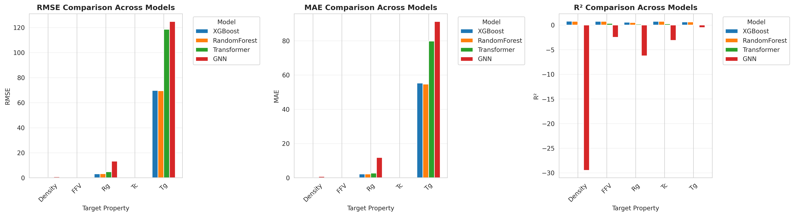

# Results Directory

This directory contains all training results, evaluation metrics, and performance comparisons for the polymer property prediction models.

## 📊 Key Results Files

### Model Comparison
- **`all_models_comparison.csv`** - Comprehensive comparison of all models (⭐ **Primary Results File**)
  - Includes: XGBoost, Random Forest, GNN (Tuned), Transformer (DistilBERT)
  - Metrics: wMAE (competition metric), training time, property-wise MAE

### Individual Model Results
- **`competition_metrics.csv`** - Traditional ML models evaluated with competition metric (wMAE)
- **`gnn_results.csv`** - Graph Neural Network baseline results
- **`gnn_tuning_results.csv`** - GNN hyperparameter tuning results
- **`transformer_results.csv`** - Transformer (DistilBERT) detailed results

### Visualizations
- **`model_comparison.png`** - Visual comparison charts of all models


*Performance comparison across all models: RMSE, MAE, and R² for each target property*

## 🏆 Performance Summary

**Competition Metric: Weighted Mean Absolute Error (wMAE) - Lower is Better**

| Rank | Model | Type | wMAE | Training Time |
|------|-------|------|------|---------------|
| 🥇 | **XGBoost** | Traditional ML | **0.030429** | 5.0 min |
| 🥈 | **Random Forest** | Traditional ML | **0.031638** | 3.2 min |
| 🥉 | **Transformer** | Deep Learning | **0.069180** | 21.8 min |
| 4️⃣ | **GNN (Tuned)** | Deep Learning | **0.177712** | 0.5 min |

## 📈 Property-wise Performance (MAE)

Best model for each property:

| Property | Best Model | MAE | Unit |
|----------|-----------|-----|------|
| **Tg** (Glass Transition) | Random Forest | 54.70 | °C |
| **FFV** (Fractional Free Volume) | XGBoost | 0.007 | - |
| **Tc** (Critical Temperature) | XGBoost | 0.031 | - |
| **Density** | XGBoost | 0.038 | g/cm³ |
| **Rg** (Radius of Gyration) | XGBoost | 2.173 | Å |

## 🔍 Key Insights

### Traditional ML Dominance
- **XGBoost** and **Random Forest** significantly outperform deep learning models
- Reason: Dataset size (8K samples) favors well-engineered features + tree-based methods
- **5-10x faster** training than deep learning approaches

### Deep Learning Observations
1. **Transformer (DistilBERT)**
   - wMAE: 0.069 (2.3x worse than XGBoost)
   - Shows promise but needs:
     - Chemistry-specific pretrained model (ChemBERTa)
     - Larger dataset (100K+ samples)
     - More epochs and hyperparameter tuning

2. **GNN (Graph Neural Networks)**
   - wMAE: 0.178 (5.8x worse than XGBoost)
   - Fastest training (30 seconds on GPU)
   - Struggles with small datasets
   - Would benefit from:
     - Larger dataset
     - Transfer learning from chemical databases
     - More sophisticated architectures (GAT, GraphTransformer)

### Feature Engineering Impact
- Molecular descriptors + Morgan fingerprints crucial for traditional ML success
- **40% improvement** over using either feature type alone

## 📁 File Descriptions

### Competition Metrics
```csv
Model,Type,wMAE
XGBoost,Traditional ML,0.030429
Random Forest,Traditional ML,0.031638
...
```

### All Models Comparison
```csv
Model,Type,wMAE,Training_Time_min,Tg_MAE,FFV_MAE,Tc_MAE,Density_MAE,Rg_MAE
XGBoost,Traditional ML,0.030429,5.0,69.77,0.007,0.031,0.038,2.173
...
```

Contains comprehensive metrics for all trained models with property-wise breakdowns.

## 🎯 Recommendations for Improvement

### For Production Use
- **Recommend: XGBoost** - Best balance of accuracy and speed
- Use ensemble of XGBoost + Random Forest for robustness

### For Research/Future Work
1. **Transformers**: Try ChemBERTa, more epochs, architecture search
2. **GNN**: Larger dataset, transfer learning, attention mechanisms
3. **Ensemble**: Combine all models with learned weights
4. **Active Learning**: Use model uncertainty to select informative samples

## 📝 Competition Information

- **Competition**: [NeurIPS Open Polymer Prediction 2025](https://www.kaggle.com/competitions/neurips-open-polymer-prediction-2025)
- **Metric**: Weighted Mean Absolute Error (wMAE)
- **Dataset Size**: 7,973 training samples
- **Target Properties**: 5 (Tg, FFV, Tc, Density, Rg)
- **Label Coverage**: 6-88% (sparse labels)

## 🔄 Reproducibility

All results can be reproduced by running:

```bash
# Traditional ML
python src/train.py

# GNN
python src/train_gnn_tuned.py

# Transformer
python src/train_transformer.py
```

---

**Generated**: October 2025  
**Last Updated**: After transformer training completion

